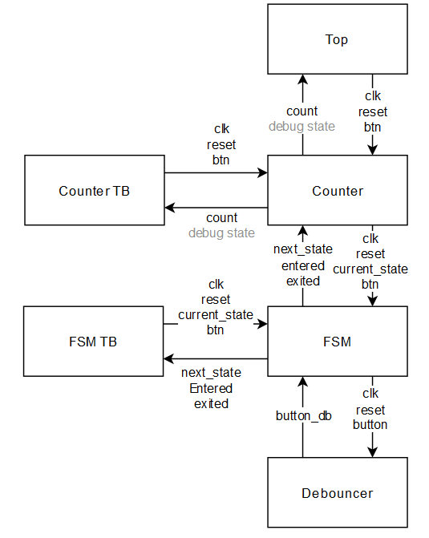
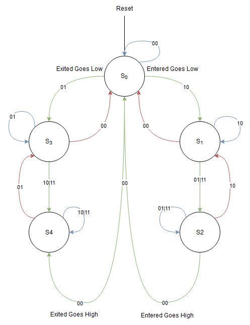

\clearpage

### Block Diagram

{ width=85% }

\clearpage

### State Diagram

{ width=85% }

\clearpage

### Truth Table
| Current State | a     | b     | Next State | Entered | Exited |
|---------------|-------|-------|------------|---------|--------|
| S0            | 0     | 0     | S0         | 0       | 0      |
| S0            | 0     | 1     | S3         | 0       | 0      |
| S0            | 1     | 0     | S1         | 0       | 0      |
| S0            | 1     | 1     | Impossible | 0       | 0      |
| S1            | 0     | 0     | S0         | 0       | 0      |
| S1            | 0     | 1     | S2         | 0       | 0      |
| S1            | 1     | 0     | S1         | 0       | 0      |
| S1            | 1     | 1     | S2         | 0       | 0      |
| S2            | 0     | 0     | S0         | 1       | 0      |
| S2            | 0     | 1     | S2         | 0       | 0      |
| S2            | 1     | 0     | S1         | 0       | 0      |
| S2            | 1     | 1     | S2         | 0       | 0      |
| S3            | 0     | 0     | S0         | 0       | 0      |
| S3            | 0     | 1     | S3         | 0       | 0      |
| S3            | 1     | 0     | S4         | 0       | 0      |
| S3            | 1     | 1     | S4         | 0       | 0      |
| S4            | 0     | 0     | S0         | 0       | 1      |
| S4            | 0     | 1     | S3         | 0       | 0      |
| S4            | 1     | 0     | S4         | 0       | 0      |
| S4            | 1     | 1     | S4         | 0       | 0      |

### Mealy vs Moore Machines
A Moore machine is a finite state machine where the outputs are only dependent on the current state. A Mealy machine is a finite state machine where the outputs are dependent on the current state and the inputs. The machine I have designed is a Mealy machine because the output is dependent on the current state and the inputs.

### Appendices
Attached in the Zip is all of the code used including tcl and batch scripts for the simulation, bitstream generation and programming of the FPGA. This is also all uploaded on my GitHub:\
https://github.com/Patrick941/Integrated-System-Design