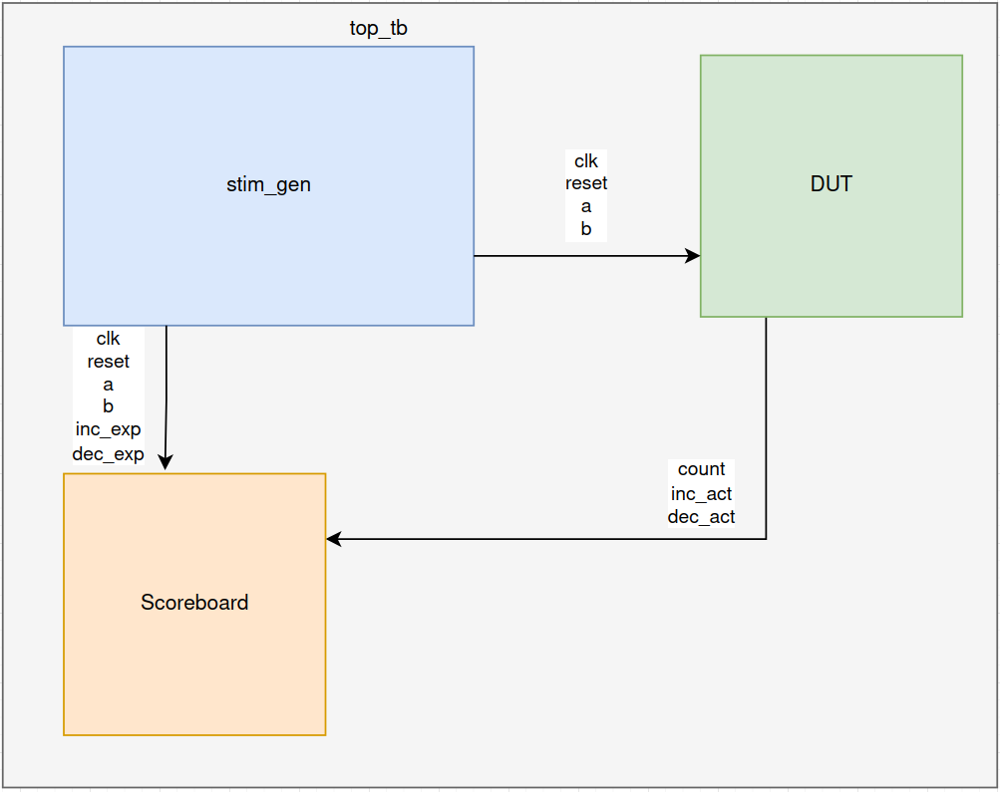
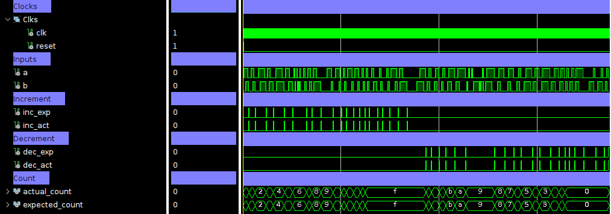
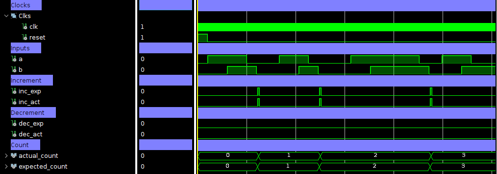

\clearpage

## Introduction
The purpose of this lab is to design an advanced testbench for an existing design created in the previous lab. In this lab we used the Universal Verification Methodology (UVM) in System Verilog to create an advanced testbench.\
The testbench used a number of different blocks, the DUT, the stimulus generator and the scoreboard which will all be discussed more in later sections. The testbench designed is self-checking and reports the result of the checks in an automatically generated log file (HVM.log).

## Implementation Details
The first thing produced in this Lab was a TCL script that was able to run the testbench by creating a virtual temporary project adding the relevant files setting the top module and running the simulation until the testbench signals $finish. Then a bash (for linux) and batch (for windows) scripts were written as wrappers which renamed files that are to be saved and removed unwanted files from the project.\
Initially the stimulus_generator module was set as the top for development as this module generations the clock signals and the inputs to the DUT. Once this was working the top module was set as the top and the stimulus generator was instantiated inside it which worked as expected. Then the counter was also instantiated inside the top module and a simple scoreboard module written to check the outputs of the DUT.\
This scoreboard module printed when the testbench described logic expected an increase or decrease in the count, at this time the actual and expected signals for increment, decrement and count were compared and printed with a 'PASS' or 'FAIL' label. This uncovered a bug in the FSM written in the last lab. The design still worked but the signals did not match the testbench described signals. This was then fixed and some tests were run on the now working rtl and testbench with bug insertion which will be discussed in the next section.

## Design Approach
#### Role of Testbench Blocks
1. **Stimulus Generator**\
The first testbench block is the stimulus generator. The purpose of the stimulus generator is to generate clock signals and inputs to the DUT. The inputs generated are constrained random inputs. The sequence is of undetermined length and varies but has an expected output which triggers a check in the scoreboard when reached. There are 4 different tasks in the block. They generate the sequences for a successful entrance of a car, failed entrance of a car, successful exit of a car, failed exit of a car. Also checked is how the code handles an entrance of a car to a full car park and an exit of a car from an empty car park, which are both designed to cap and floor at 15 and 0 respectively.
2. **DUT**\
Although not a testbench block I will give a brief description. The DUT is a FSM wrapped in a counter that senses cars going in and out of a car park, it also keeps track of the amount of cars in the car park. The signals of increment, decrement and count are all passed up to the top module testbench.
3. **Scoreboard**\
The scoreboard is the final testbench block. Upon each rising edge of an expected increment it will compare the actual signals of increment, decrement and count to the expected signals. If they match it will write 'PASS' and if they do not it will write 'FAIL', along with the values of the signals this is then written to a log file.
4. **Top TB**\
The top module very simple instantiates each of the above modules and has wires to connect the modules as shown in the below block diagram.\


#### Tested Scenarios
1. **Successful Entrance**\
The first scenario tested was a simple entrance of a car to the car park. This was tested by the stimulus generator producing a sequence of constrained random inputs that eventually reach a state where it expects an increment, it then rights expected increments high and compares the value against actual increment. It will also check count against actual count and report the result. This scenario passed.
1. **Failed Entrance**\
The failed entrance scenario is the test of the beginning of the sequence that did not reach completion. This was tested by the stimulus generator producing a sequence of constrained random inputs that eventually return to state 0. This can be due to noise on the sensors or due to a car beginning to enter and reversing out. This is tested by ensuring the count still matches the testbench expected count. This scenario passed.
2. **Successful Exit**\
The successful exit scenario is the scenario was a car exits the car park. This was tested by the stimulus generator producing a sequence of constrained random inputs that eventually reach a state where it expects a decrement, it then rights expected decrements high and compares the value against actual decrement. It will also check count against actual count and report the result. This scenario passed.
3. **Failed Exit**\
The failed exit scenario is the test of the beginning of the sequence that did not reach completion. This was tested by the stimulus generator producing a sequence of constrained random inputs that eventually return to state 0. This can be due to noise on the sensors or due to a car beginning to exit and reversing back in. This is tested by ensuring the count still matches the testbench expected count. This scenario passed.
4. **Full Car Park**\
This is the test where the successful entrance scenario is ran a number of times greater than 15. After each entrance the scoreboard checks the actual increment and expected increment which are supposed both to be high. It will also check the actual and expected count though which are not supposed to increment even though the increment signals are high as they are capped at 15. This scenario passed.
5. **Empty Car Park**\
This is the test where the successful exit scenario is ran a number of times greater than 15. After each exit the scoreboard checks the actual decrement and expected decrement which are supposed both to be high. It will also check the actual and expected count though which are not supposed to decrement even though the decrement signals are high as they are floored at 0. This scenario passed.

#### Response to Bugs
As previously mentioned the writing of the scoreboard showed an inconsistency between the actual and expected signals of the DUT and the stimulus generator. The bug was in the FSM written in the previous lab. The difference was the previous FSM was a 5 state machine that accepted the sequence for entrance as:\
00 - 10 - 11 - 00\
00 - 10 - 11 - 01 - 00\
And accepted the sequence for exit as:\
00 - 01 - 11 - 00\
00 - 01 - 11 - 10 - 00\
This was intentional to allow a car to enter quickly once the barrier was raised and to still be detected, this was specified in the lab brief to not be the desired functionality though and the FSM was rewritten to a 7 state machine that only accepted the entrance and exit sequences as:\
00 - 10 - 11 - 01 - 00\
00 - 01 - 11 - 10 - 00\
respectively. This fixed the bug and the actual and testbench signals now matched.\
**Bug Insertion**\
Bugs were inserted into the DUT in a number of places and the testbench run to see if the scoreboard could detect them. The bugs inserted were:
1. **Capping Bug**\
*(The following logs were made with smaller sensitivity lists for readability)*\
This will mean that the count rolls round to 0 instead of capping. *Result: Successful Failure Capture*\

\tiny
```log
PASS: Count: 0, Local Count: 0, a: 0, b: 0, inc_act: 1, dec_act: 0, Expected inc: 1, Expected dec: 0
PASS: Count: 1, Local Count: 1, a: 0, b: 0, inc_act: 1, dec_act: 0, Expected inc: 1, Expected dec: 0
PASS: Count: 2, Local Count: 2, a: 0, b: 0, inc_act: 1, dec_act: 0, Expected inc: 1, Expected dec: 0
PASS: Count: 3, Local Count: 3, a: 0, b: 0, inc_act: 1, dec_act: 0, Expected inc: 1, Expected dec: 0
PASS: Count: 4, Local Count: 4, a: 0, b: 0, inc_act: 1, dec_act: 0, Expected inc: 1, Expected dec: 0
PASS: Count: 5, Local Count: 5, a: 0, b: 0, inc_act: 1, dec_act: 0, Expected inc: 1, Expected dec: 0
PASS: Count: 6, Local Count: 6, a: 0, b: 0, inc_act: 1, dec_act: 0, Expected inc: 1, Expected dec: 0
PASS: Count: 7, Local Count: 7, a: 0, b: 0, inc_act: 1, dec_act: 0, Expected inc: 1, Expected dec: 0
PASS: Count: 8, Local Count: 8, a: 0, b: 0, inc_act: 1, dec_act: 0, Expected inc: 1, Expected dec: 0
PASS: Count: 9, Local Count: 9, a: 0, b: 0, inc_act: 1, dec_act: 0, Expected inc: 1, Expected dec: 0
PASS: Count: 10, Local Count: 10, a: 0, b: 0, inc_act: 1, dec_act: 0, Expected inc: 1, Expected dec: 0
PASS: Count: 11, Local Count: 11, a: 0, b: 0, inc_act: 1, dec_act: 0, Expected inc: 1, Expected dec: 0
PASS: Count: 12, Local Count: 12, a: 0, b: 0, inc_act: 1, dec_act: 0, Expected inc: 1, Expected dec: 0
PASS: Count: 13, Local Count: 13, a: 0, b: 0, inc_act: 1, dec_act: 0, Expected inc: 1, Expected dec: 0
PASS: Count: 14, Local Count: 14, a: 0, b: 0, inc_act: 1, dec_act: 0, Expected inc: 1, Expected dec: 0
PASS: Count: 15, Local Count: 15, a: 0, b: 0, inc_act: 1, dec_act: 0, Expected inc: 1, Expected dec: 0
FAIL: Count: 0, Local Count: 15, a: 0, b: 0, inc_act: 1, dec_act: 0, Expected inc: 1, Expected dec: 0
FAIL: Count: 1, Local Count: 15, a: 0, b: 0, inc_act: 1, dec_act: 0, Expected inc: 1, Expected dec: 0
FAIL: Count: 2, Local Count: 15, a: 0, b: 0, inc_act: 1, dec_act: 0, Expected inc: 1, Expected dec: 0
FAIL: Count: 3, Local Count: 15, a: 0, b: 0, inc_act: 1, dec_act: 0, Expected inc: 1, Expected dec: 0
FAIL: Count: 4, Local Count: 15, a: 0, b: 0, inc_act: 1, dec_act: 0, Expected inc: 1, Expected dec: 0
FAIL: Count: 5, Local Count: 15, a: 0, b: 0, inc_act: 0, dec_act: 1, Expected inc: 0, Expected dec: 1
FAIL: Count: 4, Local Count: 14, a: 0, b: 0, inc_act: 0, dec_act: 1, Expected inc: 0, Expected dec: 1
FAIL: Count: 3, Local Count: 13, a: 0, b: 0, inc_act: 0, dec_act: 1, Expected inc: 0, Expected dec: 1
FAIL: Count: 2, Local Count: 12, a: 0, b: 0, inc_act: 0, dec_act: 1, Expected inc: 0, Expected dec: 1
FAIL: Count: 1, Local Count: 11, a: 0, b: 0, inc_act: 0, dec_act: 1, Expected inc: 0, Expected dec: 1
FAIL: Count: 0, Local Count: 10, a: 0, b: 0, inc_act: 0, dec_act: 1, Expected inc: 0, Expected dec: 1
FAIL: Count: 0, Local Count: 9, a: 0, b: 0, inc_act: 0, dec_act: 1, Expected inc: 0, Expected dec: 1
FAIL: Count: 0, Local Count: 8, a: 0, b: 0, inc_act: 0, dec_act: 1, Expected inc: 0, Expected dec: 1
FAIL: Count: 0, Local Count: 7, a: 0, b: 0, inc_act: 0, dec_act: 1, Expected inc: 0, Expected dec: 1
FAIL: Count: 0, Local Count: 6, a: 0, b: 0, inc_act: 0, dec_act: 1, Expected inc: 0, Expected dec: 1
FAIL: Count: 0, Local Count: 5, a: 0, b: 0, inc_act: 0, dec_act: 1, Expected inc: 0, Expected dec: 1
FAIL: Count: 0, Local Count: 4, a: 0, b: 0, inc_act: 0, dec_act: 1, Expected inc: 0, Expected dec: 1
FAIL: Count: 0, Local Count: 3, a: 0, b: 0, inc_act: 0, dec_act: 1, Expected inc: 0, Expected dec: 1
FAIL: Count: 0, Local Count: 2, a: 0, b: 0, inc_act: 0, dec_act: 1, Expected inc: 0, Expected dec: 1
FAIL: Count: 0, Local Count: 1, a: 0, b: 0, inc_act: 0, dec_act: 1, Expected inc: 0, Expected dec: 1
PASS: Count: 0, Local Count: 0, a: 0, b: 0, inc_act: 0, dec_act: 1, Expected inc: 0, Expected dec: 1
PASS: Count: 0, Local Count: 0, a: 0, b: 0, inc_act: 0, dec_act: 1, Expected inc: 0, Expected dec: 1
PASS: Count: 0, Local Count: 0, a: 0, b: 0, inc_act: 0, dec_act: 1, Expected inc: 0, Expected dec: 1
PASS: Count: 0, Local Count: 0, a: 0, b: 0, inc_act: 0, dec_act: 1, Expected inc: 0, Expected dec: 1
PASS: Count: 0, Local Count: 0, a: 0, b: 0, inc_act: 0, dec_act: 1, Expected inc: 0, Expected dec: 1
PASS: Count: 0, Local Count: 0, a: 0, b: 0, inc_act: 0, dec_act: 1, Expected inc: 0, Expected dec: 1
```
\normalsize

1. **State2 -> State3 Broken Link**\
This will mean that the FSM will break part way through the entrance sequence. No entrance signals will go high and the count will not increment. *Result: Successful Failure Capture*\

\tiny
```log
FAIL: Count: 0, Local Count: 0, a: 0, b: 0, inc_act: 0, dec_act: 0, Expected inc: 1, Expected dec: 0
FAIL: Count: 0, Local Count: 1, a: 0, b: 0, inc_act: 0, dec_act: 0, Expected inc: 1, Expected dec: 0
FAIL: Count: 0, Local Count: 2, a: 0, b: 0, inc_act: 0, dec_act: 0, Expected inc: 1, Expected dec: 0
FAIL: Count: 0, Local Count: 3, a: 0, b: 0, inc_act: 0, dec_act: 0, Expected inc: 1, Expected dec: 0
FAIL: Count: 0, Local Count: 4, a: 0, b: 0, inc_act: 0, dec_act: 0, Expected inc: 1, Expected dec: 0
FAIL: Count: 0, Local Count: 5, a: 0, b: 0, inc_act: 0, dec_act: 0, Expected inc: 1, Expected dec: 0
FAIL: Count: 0, Local Count: 6, a: 0, b: 0, inc_act: 0, dec_act: 0, Expected inc: 1, Expected dec: 0
FAIL: Count: 0, Local Count: 7, a: 0, b: 0, inc_act: 0, dec_act: 0, Expected inc: 1, Expected dec: 0
FAIL: Count: 0, Local Count: 8, a: 0, b: 0, inc_act: 0, dec_act: 0, Expected inc: 1, Expected dec: 0
FAIL: Count: 0, Local Count: 9, a: 0, b: 0, inc_act: 0, dec_act: 0, Expected inc: 1, Expected dec: 0
FAIL: Count: 0, Local Count: 10, a: 0, b: 0, inc_act: 0, dec_act: 0, Expected inc: 1, Expected dec: 0
FAIL: Count: 0, Local Count: 11, a: 0, b: 0, inc_act: 0, dec_act: 0, Expected inc: 1, Expected dec: 0
FAIL: Count: 0, Local Count: 12, a: 0, b: 0, inc_act: 0, dec_act: 0, Expected inc: 1, Expected dec: 0
FAIL: Count: 0, Local Count: 13, a: 0, b: 0, inc_act: 0, dec_act: 0, Expected inc: 1, Expected dec: 0
FAIL: Count: 0, Local Count: 14, a: 0, b: 0, inc_act: 0, dec_act: 0, Expected inc: 1, Expected dec: 0
FAIL: Count: 0, Local Count: 15, a: 0, b: 0, inc_act: 0, dec_act: 0, Expected inc: 1, Expected dec: 0
FAIL: Count: 0, Local Count: 15, a: 0, b: 0, inc_act: 0, dec_act: 0, Expected inc: 1, Expected dec: 0
FAIL: Count: 0, Local Count: 15, a: 0, b: 0, inc_act: 0, dec_act: 0, Expected inc: 1, Expected dec: 0
FAIL: Count: 0, Local Count: 15, a: 0, b: 0, inc_act: 0, dec_act: 0, Expected inc: 1, Expected dec: 0
FAIL: Count: 0, Local Count: 15, a: 0, b: 0, inc_act: 0, dec_act: 0, Expected inc: 1, Expected dec: 0
FAIL: Count: 0, Local Count: 15, a: 0, b: 0, inc_act: 0, dec_act: 0, Expected inc: 1, Expected dec: 0
FAIL: Count: 0, Local Count: 15, a: 0, b: 0, inc_act: 0, dec_act: 1, Expected inc: 0, Expected dec: 1
FAIL: Count: 0, Local Count: 14, a: 0, b: 0, inc_act: 0, dec_act: 1, Expected inc: 0, Expected dec: 1
FAIL: Count: 0, Local Count: 13, a: 0, b: 0, inc_act: 0, dec_act: 1, Expected inc: 0, Expected dec: 1
FAIL: Count: 0, Local Count: 12, a: 0, b: 0, inc_act: 0, dec_act: 1, Expected inc: 0, Expected dec: 1
FAIL: Count: 0, Local Count: 11, a: 0, b: 0, inc_act: 0, dec_act: 1, Expected inc: 0, Expected dec: 1
FAIL: Count: 0, Local Count: 10, a: 0, b: 0, inc_act: 0, dec_act: 1, Expected inc: 0, Expected dec: 1
FAIL: Count: 0, Local Count: 9, a: 0, b: 0, inc_act: 0, dec_act: 1, Expected inc: 0, Expected dec: 1
FAIL: Count: 0, Local Count: 8, a: 0, b: 0, inc_act: 0, dec_act: 1, Expected inc: 0, Expected dec: 1
FAIL: Count: 0, Local Count: 7, a: 0, b: 0, inc_act: 0, dec_act: 1, Expected inc: 0, Expected dec: 1
FAIL: Count: 0, Local Count: 6, a: 0, b: 0, inc_act: 0, dec_act: 1, Expected inc: 0, Expected dec: 1
FAIL: Count: 0, Local Count: 5, a: 0, b: 0, inc_act: 0, dec_act: 1, Expected inc: 0, Expected dec: 1
FAIL: Count: 0, Local Count: 4, a: 0, b: 0, inc_act: 0, dec_act: 1, Expected inc: 0, Expected dec: 1
FAIL: Count: 0, Local Count: 3, a: 0, b: 0, inc_act: 0, dec_act: 1, Expected inc: 0, Expected dec: 1
FAIL: Count: 0, Local Count: 2, a: 0, b: 0, inc_act: 0, dec_act: 1, Expected inc: 0, Expected dec: 1
FAIL: Count: 0, Local Count: 1, a: 0, b: 0, inc_act: 0, dec_act: 1, Expected inc: 0, Expected dec: 1
PASS: Count: 0, Local Count: 0, a: 0, b: 0, inc_act: 0, dec_act: 1, Expected inc: 0, Expected dec: 1
PASS: Count: 0, Local Count: 0, a: 0, b: 0, inc_act: 0, dec_act: 1, Expected inc: 0, Expected dec: 1
PASS: Count: 0, Local Count: 0, a: 0, b: 0, inc_act: 0, dec_act: 1, Expected inc: 0, Expected dec: 1
PASS: Count: 0, Local Count: 0, a: 0, b: 0, inc_act: 0, dec_act: 1, Expected inc: 0, Expected dec: 1
PASS: Count: 0, Local Count: 0, a: 0, b: 0, inc_act: 0, dec_act: 1, Expected inc: 0, Expected dec: 1
PASS: Count: 0, Local Count: 0, a: 0, b: 0, inc_act: 0, dec_act: 1, Expected inc: 0, Expected dec: 1
```
\normalsize

1. **State4 -> State0||State5 Broken Link**\
This will mean that the FSM will never leave state 4 and the FSM will hang. *Result: Successful Failure Capture*\

\tiny
```log
PASS: Count: 0, Local Count: 0, a: 0, b: 0, inc_act: 1, dec_act: 0, Expected inc: 1, Expected dec: 0
PASS: Count: 1, Local Count: 1, a: 0, b: 0, inc_act: 1, dec_act: 0, Expected inc: 1, Expected dec: 0
PASS: Count: 2, Local Count: 2, a: 0, b: 0, inc_act: 1, dec_act: 0, Expected inc: 1, Expected dec: 0
PASS: Count: 3, Local Count: 3, a: 0, b: 0, inc_act: 1, dec_act: 0, Expected inc: 1, Expected dec: 0
PASS: Count: 4, Local Count: 4, a: 0, b: 0, inc_act: 1, dec_act: 0, Expected inc: 1, Expected dec: 0
PASS: Count: 5, Local Count: 5, a: 0, b: 0, inc_act: 1, dec_act: 0, Expected inc: 1, Expected dec: 0
FAIL: Count: 6, Local Count: 6, a: 0, b: 0, inc_act: 0, dec_act: 0, Expected inc: 1, Expected dec: 0
FAIL: Count: 6, Local Count: 7, a: 0, b: 0, inc_act: 0, dec_act: 0, Expected inc: 1, Expected dec: 0
FAIL: Count: 6, Local Count: 8, a: 0, b: 0, inc_act: 0, dec_act: 0, Expected inc: 1, Expected dec: 0
FAIL: Count: 6, Local Count: 9, a: 0, b: 0, inc_act: 0, dec_act: 0, Expected inc: 1, Expected dec: 0
FAIL: Count: 6, Local Count: 10, a: 0, b: 0, inc_act: 0, dec_act: 0, Expected inc: 1, Expected dec: 0
FAIL: Count: 6, Local Count: 11, a: 0, b: 0, inc_act: 0, dec_act: 0, Expected inc: 1, Expected dec: 0
FAIL: Count: 6, Local Count: 12, a: 0, b: 0, inc_act: 0, dec_act: 0, Expected inc: 1, Expected dec: 0
FAIL: Count: 6, Local Count: 13, a: 0, b: 0, inc_act: 0, dec_act: 0, Expected inc: 1, Expected dec: 0
FAIL: Count: 6, Local Count: 14, a: 0, b: 0, inc_act: 0, dec_act: 0, Expected inc: 1, Expected dec: 0
FAIL: Count: 6, Local Count: 15, a: 0, b: 0, inc_act: 0, dec_act: 0, Expected inc: 1, Expected dec: 0
FAIL: Count: 6, Local Count: 15, a: 0, b: 0, inc_act: 0, dec_act: 0, Expected inc: 1, Expected dec: 0
FAIL: Count: 6, Local Count: 15, a: 0, b: 0, inc_act: 0, dec_act: 0, Expected inc: 1, Expected dec: 0
FAIL: Count: 6, Local Count: 15, a: 0, b: 0, inc_act: 0, dec_act: 0, Expected inc: 1, Expected dec: 0
FAIL: Count: 6, Local Count: 15, a: 0, b: 0, inc_act: 0, dec_act: 0, Expected inc: 1, Expected dec: 0
FAIL: Count: 6, Local Count: 15, a: 0, b: 0, inc_act: 0, dec_act: 0, Expected inc: 1, Expected dec: 0
FAIL: Count: 6, Local Count: 15, a: 0, b: 0, inc_act: 0, dec_act: 0, Expected inc: 0, Expected dec: 1
FAIL: Count: 6, Local Count: 14, a: 0, b: 0, inc_act: 0, dec_act: 0, Expected inc: 0, Expected dec: 1
FAIL: Count: 6, Local Count: 13, a: 0, b: 0, inc_act: 0, dec_act: 0, Expected inc: 0, Expected dec: 1
FAIL: Count: 6, Local Count: 12, a: 0, b: 0, inc_act: 0, dec_act: 0, Expected inc: 0, Expected dec: 1
FAIL: Count: 6, Local Count: 11, a: 0, b: 0, inc_act: 0, dec_act: 0, Expected inc: 0, Expected dec: 1
FAIL: Count: 6, Local Count: 10, a: 0, b: 0, inc_act: 0, dec_act: 0, Expected inc: 0, Expected dec: 1
FAIL: Count: 6, Local Count: 9, a: 0, b: 0, inc_act: 0, dec_act: 0, Expected inc: 0, Expected dec: 1
FAIL: Count: 6, Local Count: 8, a: 0, b: 0, inc_act: 0, dec_act: 0, Expected inc: 0, Expected dec: 1
FAIL: Count: 6, Local Count: 7, a: 0, b: 0, inc_act: 0, dec_act: 0, Expected inc: 0, Expected dec: 1
FAIL: Count: 6, Local Count: 6, a: 0, b: 0, inc_act: 0, dec_act: 0, Expected inc: 0, Expected dec: 1
FAIL: Count: 6, Local Count: 5, a: 0, b: 0, inc_act: 0, dec_act: 0, Expected inc: 0, Expected dec: 1
FAIL: Count: 6, Local Count: 4, a: 0, b: 0, inc_act: 0, dec_act: 0, Expected inc: 0, Expected dec: 1
FAIL: Count: 6, Local Count: 3, a: 0, b: 0, inc_act: 0, dec_act: 0, Expected inc: 0, Expected dec: 1
FAIL: Count: 6, Local Count: 2, a: 0, b: 0, inc_act: 0, dec_act: 0, Expected inc: 0, Expected dec: 1
FAIL: Count: 6, Local Count: 1, a: 0, b: 0, inc_act: 0, dec_act: 0, Expected inc: 0, Expected dec: 1
FAIL: Count: 6, Local Count: 0, a: 0, b: 0, inc_act: 0, dec_act: 0, Expected inc: 0, Expected dec: 1
FAIL: Count: 6, Local Count: 0, a: 0, b: 0, inc_act: 0, dec_act: 0, Expected inc: 0, Expected dec: 1
FAIL: Count: 6, Local Count: 0, a: 0, b: 0, inc_act: 0, dec_act: 0, Expected inc: 0, Expected dec: 1
FAIL: Count: 6, Local Count: 0, a: 0, b: 0, inc_act: 0, dec_act: 0, Expected inc: 0, Expected dec: 1
FAIL: Count: 6, Local Count: 0, a: 0, b: 0, inc_act: 0, dec_act: 0, Expected inc: 0, Expected dec: 1
FAIL: Count: 6, Local Count: 0, a: 0, b: 0, inc_act: 0, dec_act: 0, Expected inc: 0, Expected dec: 1
```
\normalsize

1. **State5 -> State6 Broken Link**\ 
This will mean that the FSM will break part way through the exit sequence. No exit signals will go high and the count will not decrement. *Result: Successful Failure Capture*\

\tiny
```log
PASS: Count: 0, Local Count: 0, a: 0, b: 0, inc_act: 1, dec_act: 0, Expected inc: 1, Expected dec: 0
PASS: Count: 1, Local Count: 1, a: 0, b: 0, inc_act: 1, dec_act: 0, Expected inc: 1, Expected dec: 0
PASS: Count: 2, Local Count: 2, a: 0, b: 0, inc_act: 1, dec_act: 0, Expected inc: 1, Expected dec: 0
PASS: Count: 3, Local Count: 3, a: 0, b: 0, inc_act: 1, dec_act: 0, Expected inc: 1, Expected dec: 0
PASS: Count: 4, Local Count: 4, a: 0, b: 0, inc_act: 1, dec_act: 0, Expected inc: 1, Expected dec: 0
PASS: Count: 5, Local Count: 5, a: 0, b: 0, inc_act: 1, dec_act: 0, Expected inc: 1, Expected dec: 0
PASS: Count: 6, Local Count: 6, a: 0, b: 0, inc_act: 1, dec_act: 0, Expected inc: 1, Expected dec: 0
PASS: Count: 7, Local Count: 7, a: 0, b: 0, inc_act: 1, dec_act: 0, Expected inc: 1, Expected dec: 0
PASS: Count: 8, Local Count: 8, a: 0, b: 0, inc_act: 1, dec_act: 0, Expected inc: 1, Expected dec: 0
PASS: Count: 9, Local Count: 9, a: 0, b: 0, inc_act: 1, dec_act: 0, Expected inc: 1, Expected dec: 0
PASS: Count: 10, Local Count: 10, a: 0, b: 0, inc_act: 1, dec_act: 0, Expected inc: 1, Expected dec: 0
PASS: Count: 11, Local Count: 11, a: 0, b: 0, inc_act: 1, dec_act: 0, Expected inc: 1, Expected dec: 0
PASS: Count: 12, Local Count: 12, a: 0, b: 0, inc_act: 1, dec_act: 0, Expected inc: 1, Expected dec: 0
PASS: Count: 13, Local Count: 13, a: 0, b: 0, inc_act: 1, dec_act: 0, Expected inc: 1, Expected dec: 0
PASS: Count: 14, Local Count: 14, a: 0, b: 0, inc_act: 1, dec_act: 0, Expected inc: 1, Expected dec: 0
PASS: Count: 15, Local Count: 15, a: 0, b: 0, inc_act: 1, dec_act: 0, Expected inc: 1, Expected dec: 0
PASS: Count: 15, Local Count: 15, a: 0, b: 0, inc_act: 1, dec_act: 0, Expected inc: 1, Expected dec: 0
PASS: Count: 15, Local Count: 15, a: 0, b: 0, inc_act: 1, dec_act: 0, Expected inc: 1, Expected dec: 0
PASS: Count: 15, Local Count: 15, a: 0, b: 0, inc_act: 1, dec_act: 0, Expected inc: 1, Expected dec: 0
PASS: Count: 15, Local Count: 15, a: 0, b: 0, inc_act: 1, dec_act: 0, Expected inc: 1, Expected dec: 0
PASS: Count: 15, Local Count: 15, a: 0, b: 0, inc_act: 1, dec_act: 0, Expected inc: 1, Expected dec: 0
FAIL: Count: 15, Local Count: 15, a: 0, b: 0, inc_act: 0, dec_act: 0, Expected inc: 0, Expected dec: 1
FAIL: Count: 15, Local Count: 14, a: 0, b: 0, inc_act: 0, dec_act: 0, Expected inc: 0, Expected dec: 1
FAIL: Count: 15, Local Count: 13, a: 0, b: 0, inc_act: 0, dec_act: 0, Expected inc: 0, Expected dec: 1
FAIL: Count: 15, Local Count: 12, a: 0, b: 0, inc_act: 0, dec_act: 0, Expected inc: 0, Expected dec: 1
FAIL: Count: 15, Local Count: 11, a: 0, b: 0, inc_act: 0, dec_act: 0, Expected inc: 0, Expected dec: 1
FAIL: Count: 15, Local Count: 10, a: 0, b: 0, inc_act: 0, dec_act: 0, Expected inc: 0, Expected dec: 1
FAIL: Count: 15, Local Count: 9, a: 0, b: 0, inc_act: 0, dec_act: 0, Expected inc: 0, Expected dec: 1
FAIL: Count: 15, Local Count: 8, a: 0, b: 0, inc_act: 0, dec_act: 0, Expected inc: 0, Expected dec: 1
FAIL: Count: 15, Local Count: 7, a: 0, b: 0, inc_act: 0, dec_act: 0, Expected inc: 0, Expected dec: 1
FAIL: Count: 15, Local Count: 6, a: 0, b: 0, inc_act: 0, dec_act: 0, Expected inc: 0, Expected dec: 1
FAIL: Count: 15, Local Count: 5, a: 0, b: 0, inc_act: 0, dec_act: 0, Expected inc: 0, Expected dec: 1
FAIL: Count: 15, Local Count: 4, a: 0, b: 0, inc_act: 0, dec_act: 0, Expected inc: 0, Expected dec: 1
FAIL: Count: 15, Local Count: 3, a: 0, b: 0, inc_act: 0, dec_act: 0, Expected inc: 0, Expected dec: 1
FAIL: Count: 15, Local Count: 2, a: 0, b: 0, inc_act: 0, dec_act: 0, Expected inc: 0, Expected dec: 1
FAIL: Count: 15, Local Count: 1, a: 0, b: 0, inc_act: 0, dec_act: 0, Expected inc: 0, Expected dec: 1
FAIL: Count: 15, Local Count: 0, a: 0, b: 0, inc_act: 0, dec_act: 0, Expected inc: 0, Expected dec: 1
FAIL: Count: 15, Local Count: 0, a: 0, b: 0, inc_act: 0, dec_act: 0, Expected inc: 0, Expected dec: 1
FAIL: Count: 15, Local Count: 0, a: 0, b: 0, inc_act: 0, dec_act: 0, Expected inc: 0, Expected dec: 1
FAIL: Count: 15, Local Count: 0, a: 0, b: 0, inc_act: 0, dec_act: 0, Expected inc: 0, Expected dec: 1
FAIL: Count: 15, Local Count: 0, a: 0, b: 0, inc_act: 0, dec_act: 0, Expected inc: 0, Expected dec: 1
FAIL: Count: 15, Local Count: 0, a: 0, b: 0, inc_act: 0, dec_act: 0, Expected inc: 0, Expected dec: 1
```
\normalsize

1. **Broken Incrementer**\
The increment signal will go high but the count will not increment. *Result: Successful Failure Capture*\

\tiny
```log
PASS: Count: 0, Local Count: 0, a: 0, b: 0, inc_act: 1, dec_act: 0, Expected inc: 1, Expected dec: 0
FAIL: Count: 0, Local Count: 1, a: 0, b: 0, inc_act: 1, dec_act: 0, Expected inc: 1, Expected dec: 0
FAIL: Count: 0, Local Count: 2, a: 0, b: 0, inc_act: 1, dec_act: 0, Expected inc: 1, Expected dec: 0
FAIL: Count: 0, Local Count: 3, a: 0, b: 0, inc_act: 1, dec_act: 0, Expected inc: 1, Expected dec: 0
FAIL: Count: 0, Local Count: 4, a: 0, b: 0, inc_act: 1, dec_act: 0, Expected inc: 1, Expected dec: 0
FAIL: Count: 0, Local Count: 5, a: 0, b: 0, inc_act: 1, dec_act: 0, Expected inc: 1, Expected dec: 0
FAIL: Count: 0, Local Count: 6, a: 0, b: 0, inc_act: 1, dec_act: 0, Expected inc: 1, Expected dec: 0
FAIL: Count: 0, Local Count: 7, a: 0, b: 0, inc_act: 1, dec_act: 0, Expected inc: 1, Expected dec: 0
FAIL: Count: 0, Local Count: 8, a: 0, b: 0, inc_act: 1, dec_act: 0, Expected inc: 1, Expected dec: 0
FAIL: Count: 0, Local Count: 9, a: 0, b: 0, inc_act: 1, dec_act: 0, Expected inc: 1, Expected dec: 0
FAIL: Count: 0, Local Count: 10, a: 0, b: 0, inc_act: 1, dec_act: 0, Expected inc: 1, Expected dec: 0
FAIL: Count: 0, Local Count: 11, a: 0, b: 0, inc_act: 1, dec_act: 0, Expected inc: 1, Expected dec: 0
FAIL: Count: 0, Local Count: 12, a: 0, b: 0, inc_act: 1, dec_act: 0, Expected inc: 1, Expected dec: 0
FAIL: Count: 0, Local Count: 13, a: 0, b: 0, inc_act: 1, dec_act: 0, Expected inc: 1, Expected dec: 0
FAIL: Count: 0, Local Count: 14, a: 0, b: 0, inc_act: 1, dec_act: 0, Expected inc: 1, Expected dec: 0
FAIL: Count: 0, Local Count: 15, a: 0, b: 0, inc_act: 1, dec_act: 0, Expected inc: 1, Expected dec: 0
FAIL: Count: 0, Local Count: 15, a: 0, b: 0, inc_act: 1, dec_act: 0, Expected inc: 1, Expected dec: 0
FAIL: Count: 0, Local Count: 15, a: 0, b: 0, inc_act: 1, dec_act: 0, Expected inc: 1, Expected dec: 0
FAIL: Count: 0, Local Count: 15, a: 0, b: 0, inc_act: 1, dec_act: 0, Expected inc: 1, Expected dec: 0
FAIL: Count: 0, Local Count: 15, a: 0, b: 0, inc_act: 1, dec_act: 0, Expected inc: 1, Expected dec: 0
FAIL: Count: 0, Local Count: 15, a: 0, b: 0, inc_act: 1, dec_act: 0, Expected inc: 1, Expected dec: 0
FAIL: Count: 0, Local Count: 15, a: 0, b: 0, inc_act: 0, dec_act: 1, Expected inc: 0, Expected dec: 1
FAIL: Count: 0, Local Count: 14, a: 0, b: 0, inc_act: 0, dec_act: 1, Expected inc: 0, Expected dec: 1
FAIL: Count: 0, Local Count: 13, a: 0, b: 0, inc_act: 0, dec_act: 1, Expected inc: 0, Expected dec: 1
FAIL: Count: 0, Local Count: 12, a: 0, b: 0, inc_act: 0, dec_act: 1, Expected inc: 0, Expected dec: 1
FAIL: Count: 0, Local Count: 11, a: 0, b: 0, inc_act: 0, dec_act: 1, Expected inc: 0, Expected dec: 1
FAIL: Count: 0, Local Count: 10, a: 0, b: 0, inc_act: 0, dec_act: 1, Expected inc: 0, Expected dec: 1
FAIL: Count: 0, Local Count: 9, a: 0, b: 0, inc_act: 0, dec_act: 1, Expected inc: 0, Expected dec: 1
FAIL: Count: 0, Local Count: 8, a: 0, b: 0, inc_act: 0, dec_act: 1, Expected inc: 0, Expected dec: 1
FAIL: Count: 0, Local Count: 7, a: 0, b: 0, inc_act: 0, dec_act: 1, Expected inc: 0, Expected dec: 1
FAIL: Count: 0, Local Count: 6, a: 0, b: 0, inc_act: 0, dec_act: 1, Expected inc: 0, Expected dec: 1
FAIL: Count: 0, Local Count: 5, a: 0, b: 0, inc_act: 0, dec_act: 1, Expected inc: 0, Expected dec: 1
FAIL: Count: 0, Local Count: 4, a: 0, b: 0, inc_act: 0, dec_act: 1, Expected inc: 0, Expected dec: 1
FAIL: Count: 0, Local Count: 3, a: 0, b: 0, inc_act: 0, dec_act: 1, Expected inc: 0, Expected dec: 1
FAIL: Count: 0, Local Count: 2, a: 0, b: 0, inc_act: 0, dec_act: 1, Expected inc: 0, Expected dec: 1
FAIL: Count: 0, Local Count: 1, a: 0, b: 0, inc_act: 0, dec_act: 1, Expected inc: 0, Expected dec: 1
PASS: Count: 0, Local Count: 0, a: 0, b: 0, inc_act: 0, dec_act: 1, Expected inc: 0, Expected dec: 1
PASS: Count: 0, Local Count: 0, a: 0, b: 0, inc_act: 0, dec_act: 1, Expected inc: 0, Expected dec: 1
PASS: Count: 0, Local Count: 0, a: 0, b: 0, inc_act: 0, dec_act: 1, Expected inc: 0, Expected dec: 1
PASS: Count: 0, Local Count: 0, a: 0, b: 0, inc_act: 0, dec_act: 1, Expected inc: 0, Expected dec: 1
PASS: Count: 0, Local Count: 0, a: 0, b: 0, inc_act: 0, dec_act: 1, Expected inc: 0, Expected dec: 1
PASS: Count: 0, Local Count: 0, a: 0, b: 0, inc_act: 0, dec_act: 1, Expected inc: 0, Expected dec: 1
```
\normalsize


#### Results
##### Waves:
As we can see from this first image, the FSM is working as expected. The count matches the expected count, the increment matches the expected increment and the decrement matches the expected decrement.\
\

If we take a closer look at the waves, we can see that the increment signals do match but we can see that the count is very slightly falling behind the expected count by one clock signal. This is due to the clock cycle that it takes for the FSM to increment the count.\


##### Full Log:

\tiny
```log
PASS: Count: x, Local Count: x, a: 0, b: 0, inc_act: 0, dec_act: 0, Expected inc: 0, Expected dec: 0
PASS: Count: 0, Local Count: 0, a: 0, b: 0, inc_act: 0, dec_act: 0, Expected inc: 0, Expected dec: 0
PASS: Count: 0, Local Count: 0, a: 0, b: 0, inc_act: 1, dec_act: 0, Expected inc: 1, Expected dec: 0
PASS: Count: 1, Local Count: 1, a: 0, b: 0, inc_act: 1, dec_act: 0, Expected inc: 1, Expected dec: 0
PASS: Count: 1, Local Count: 1, a: 0, b: 0, inc_act: 0, dec_act: 0, Expected inc: 0, Expected dec: 0
PASS: Count: 1, Local Count: 1, a: 0, b: 0, inc_act: 1, dec_act: 0, Expected inc: 1, Expected dec: 0
PASS: Count: 2, Local Count: 2, a: 0, b: 0, inc_act: 1, dec_act: 0, Expected inc: 1, Expected dec: 0
PASS: Count: 2, Local Count: 2, a: 0, b: 0, inc_act: 0, dec_act: 0, Expected inc: 0, Expected dec: 0
PASS: Count: 2, Local Count: 2, a: 0, b: 0, inc_act: 1, dec_act: 0, Expected inc: 1, Expected dec: 0
PASS: Count: 3, Local Count: 3, a: 0, b: 0, inc_act: 1, dec_act: 0, Expected inc: 1, Expected dec: 0
PASS: Count: 3, Local Count: 3, a: 0, b: 0, inc_act: 0, dec_act: 0, Expected inc: 0, Expected dec: 0
PASS: Count: 3, Local Count: 3, a: 0, b: 0, inc_act: 1, dec_act: 0, Expected inc: 1, Expected dec: 0
PASS: Count: 4, Local Count: 4, a: 0, b: 0, inc_act: 1, dec_act: 0, Expected inc: 1, Expected dec: 0
PASS: Count: 4, Local Count: 4, a: 0, b: 0, inc_act: 0, dec_act: 0, Expected inc: 0, Expected dec: 0
PASS: Count: 4, Local Count: 4, a: 0, b: 0, inc_act: 1, dec_act: 0, Expected inc: 1, Expected dec: 0
PASS: Count: 5, Local Count: 5, a: 0, b: 0, inc_act: 1, dec_act: 0, Expected inc: 1, Expected dec: 0
PASS: Count: 5, Local Count: 5, a: 0, b: 0, inc_act: 0, dec_act: 0, Expected inc: 0, Expected dec: 0
PASS: Count: 5, Local Count: 5, a: 0, b: 0, inc_act: 1, dec_act: 0, Expected inc: 1, Expected dec: 0
PASS: Count: 6, Local Count: 6, a: 0, b: 0, inc_act: 1, dec_act: 0, Expected inc: 1, Expected dec: 0
PASS: Count: 6, Local Count: 6, a: 0, b: 0, inc_act: 0, dec_act: 0, Expected inc: 0, Expected dec: 0
PASS: Count: 6, Local Count: 6, a: 0, b: 0, inc_act: 1, dec_act: 0, Expected inc: 1, Expected dec: 0
PASS: Count: 7, Local Count: 7, a: 0, b: 0, inc_act: 1, dec_act: 0, Expected inc: 1, Expected dec: 0
PASS: Count: 7, Local Count: 7, a: 0, b: 0, inc_act: 0, dec_act: 0, Expected inc: 0, Expected dec: 0
PASS: Count: 7, Local Count: 7, a: 0, b: 0, inc_act: 1, dec_act: 0, Expected inc: 1, Expected dec: 0
PASS: Count: 8, Local Count: 8, a: 0, b: 0, inc_act: 1, dec_act: 0, Expected inc: 1, Expected dec: 0
PASS: Count: 8, Local Count: 8, a: 0, b: 0, inc_act: 0, dec_act: 0, Expected inc: 0, Expected dec: 0
PASS: Count: 8, Local Count: 8, a: 0, b: 0, inc_act: 1, dec_act: 0, Expected inc: 1, Expected dec: 0
PASS: Count: 9, Local Count: 9, a: 0, b: 0, inc_act: 1, dec_act: 0, Expected inc: 1, Expected dec: 0
PASS: Count: 9, Local Count: 9, a: 0, b: 0, inc_act: 0, dec_act: 0, Expected inc: 0, Expected dec: 0
PASS: Count: 9, Local Count: 9, a: 0, b: 0, inc_act: 1, dec_act: 0, Expected inc: 1, Expected dec: 0
PASS: Count: 10, Local Count: 10, a: 0, b: 0, inc_act: 1, dec_act: 0, Expected inc: 1, Expected dec: 0
PASS: Count: 10, Local Count: 10, a: 0, b: 0, inc_act: 0, dec_act: 0, Expected inc: 0, Expected dec: 0
PASS: Count: 10, Local Count: 10, a: 0, b: 0, inc_act: 1, dec_act: 0, Expected inc: 1, Expected dec: 0
PASS: Count: 11, Local Count: 11, a: 0, b: 0, inc_act: 1, dec_act: 0, Expected inc: 1, Expected dec: 0
PASS: Count: 11, Local Count: 11, a: 0, b: 0, inc_act: 0, dec_act: 0, Expected inc: 0, Expected dec: 0
PASS: Count: 11, Local Count: 11, a: 0, b: 0, inc_act: 1, dec_act: 0, Expected inc: 1, Expected dec: 0
PASS: Count: 12, Local Count: 12, a: 0, b: 0, inc_act: 1, dec_act: 0, Expected inc: 1, Expected dec: 0
PASS: Count: 12, Local Count: 12, a: 0, b: 0, inc_act: 0, dec_act: 0, Expected inc: 0, Expected dec: 0
PASS: Count: 12, Local Count: 12, a: 0, b: 0, inc_act: 1, dec_act: 0, Expected inc: 1, Expected dec: 0
PASS: Count: 13, Local Count: 13, a: 0, b: 0, inc_act: 1, dec_act: 0, Expected inc: 1, Expected dec: 0
PASS: Count: 13, Local Count: 13, a: 0, b: 0, inc_act: 0, dec_act: 0, Expected inc: 0, Expected dec: 0
PASS: Count: 13, Local Count: 13, a: 0, b: 0, inc_act: 1, dec_act: 0, Expected inc: 1, Expected dec: 0
PASS: Count: 14, Local Count: 14, a: 0, b: 0, inc_act: 1, dec_act: 0, Expected inc: 1, Expected dec: 0
PASS: Count: 14, Local Count: 14, a: 0, b: 0, inc_act: 0, dec_act: 0, Expected inc: 0, Expected dec: 0
PASS: Count: 14, Local Count: 14, a: 0, b: 0, inc_act: 1, dec_act: 0, Expected inc: 1, Expected dec: 0
PASS: Count: 15, Local Count: 15, a: 0, b: 0, inc_act: 1, dec_act: 0, Expected inc: 1, Expected dec: 0
PASS: Count: 15, Local Count: 15, a: 0, b: 0, inc_act: 0, dec_act: 0, Expected inc: 0, Expected dec: 0
PASS: Count: 15, Local Count: 15, a: 0, b: 0, inc_act: 1, dec_act: 0, Expected inc: 1, Expected dec: 0
PASS: Count: 15, Local Count: 15, a: 0, b: 0, inc_act: 0, dec_act: 0, Expected inc: 0, Expected dec: 0
PASS: Count: 15, Local Count: 15, a: 0, b: 0, inc_act: 1, dec_act: 0, Expected inc: 1, Expected dec: 0
PASS: Count: 15, Local Count: 15, a: 0, b: 0, inc_act: 0, dec_act: 0, Expected inc: 0, Expected dec: 0
PASS: Count: 15, Local Count: 15, a: 0, b: 0, inc_act: 1, dec_act: 0, Expected inc: 1, Expected dec: 0
PASS: Count: 15, Local Count: 15, a: 0, b: 0, inc_act: 0, dec_act: 0, Expected inc: 0, Expected dec: 0
PASS: Count: 15, Local Count: 15, a: 0, b: 0, inc_act: 1, dec_act: 0, Expected inc: 1, Expected dec: 0
PASS: Count: 15, Local Count: 15, a: 0, b: 0, inc_act: 0, dec_act: 0, Expected inc: 0, Expected dec: 0
PASS: Count: 15, Local Count: 15, a: 0, b: 0, inc_act: 1, dec_act: 0, Expected inc: 1, Expected dec: 0
PASS: Count: 15, Local Count: 15, a: 0, b: 0, inc_act: 0, dec_act: 0, Expected inc: 0, Expected dec: 0
PASS: Count: 15, Local Count: 15, a: 0, b: 0, inc_act: 1, dec_act: 0, Expected inc: 1, Expected dec: 0
PASS: Count: 15, Local Count: 15, a: 0, b: 0, inc_act: 0, dec_act: 0, Expected inc: 0, Expected dec: 0
PASS: Count: 15, Local Count: 15, a: 0, b: 0, inc_act: 0, dec_act: 1, Expected inc: 0, Expected dec: 1
PASS: Count: 14, Local Count: 14, a: 0, b: 0, inc_act: 0, dec_act: 1, Expected inc: 0, Expected dec: 1
PASS: Count: 14, Local Count: 14, a: 0, b: 0, inc_act: 0, dec_act: 0, Expected inc: 0, Expected dec: 0
PASS: Count: 14, Local Count: 14, a: 0, b: 0, inc_act: 0, dec_act: 1, Expected inc: 0, Expected dec: 1
PASS: Count: 13, Local Count: 13, a: 0, b: 0, inc_act: 0, dec_act: 1, Expected inc: 0, Expected dec: 1
PASS: Count: 13, Local Count: 13, a: 0, b: 0, inc_act: 0, dec_act: 0, Expected inc: 0, Expected dec: 0
PASS: Count: 13, Local Count: 13, a: 0, b: 0, inc_act: 0, dec_act: 1, Expected inc: 0, Expected dec: 1
PASS: Count: 12, Local Count: 12, a: 0, b: 0, inc_act: 0, dec_act: 1, Expected inc: 0, Expected dec: 1
PASS: Count: 12, Local Count: 12, a: 0, b: 0, inc_act: 0, dec_act: 0, Expected inc: 0, Expected dec: 0
PASS: Count: 12, Local Count: 12, a: 0, b: 0, inc_act: 0, dec_act: 1, Expected inc: 0, Expected dec: 1
PASS: Count: 11, Local Count: 11, a: 0, b: 0, inc_act: 0, dec_act: 1, Expected inc: 0, Expected dec: 1
PASS: Count: 11, Local Count: 11, a: 0, b: 0, inc_act: 0, dec_act: 0, Expected inc: 0, Expected dec: 0
PASS: Count: 11, Local Count: 11, a: 0, b: 0, inc_act: 0, dec_act: 1, Expected inc: 0, Expected dec: 1
PASS: Count: 10, Local Count: 10, a: 0, b: 0, inc_act: 0, dec_act: 1, Expected inc: 0, Expected dec: 1
PASS: Count: 10, Local Count: 10, a: 0, b: 0, inc_act: 0, dec_act: 0, Expected inc: 0, Expected dec: 0
PASS: Count: 10, Local Count: 10, a: 0, b: 0, inc_act: 0, dec_act: 1, Expected inc: 0, Expected dec: 1
PASS: Count: 9, Local Count: 9, a: 0, b: 0, inc_act: 0, dec_act: 1, Expected inc: 0, Expected dec: 1
PASS: Count: 9, Local Count: 9, a: 0, b: 0, inc_act: 0, dec_act: 0, Expected inc: 0, Expected dec: 0
PASS: Count: 9, Local Count: 9, a: 0, b: 0, inc_act: 0, dec_act: 1, Expected inc: 0, Expected dec: 1
PASS: Count: 8, Local Count: 8, a: 0, b: 0, inc_act: 0, dec_act: 1, Expected inc: 0, Expected dec: 1
PASS: Count: 8, Local Count: 8, a: 0, b: 0, inc_act: 0, dec_act: 0, Expected inc: 0, Expected dec: 0
PASS: Count: 8, Local Count: 8, a: 0, b: 0, inc_act: 0, dec_act: 1, Expected inc: 0, Expected dec: 1
PASS: Count: 7, Local Count: 7, a: 0, b: 0, inc_act: 0, dec_act: 1, Expected inc: 0, Expected dec: 1
PASS: Count: 7, Local Count: 7, a: 0, b: 0, inc_act: 0, dec_act: 0, Expected inc: 0, Expected dec: 0
PASS: Count: 7, Local Count: 7, a: 0, b: 0, inc_act: 0, dec_act: 1, Expected inc: 0, Expected dec: 1
PASS: Count: 6, Local Count: 6, a: 0, b: 0, inc_act: 0, dec_act: 1, Expected inc: 0, Expected dec: 1
PASS: Count: 6, Local Count: 6, a: 0, b: 0, inc_act: 0, dec_act: 0, Expected inc: 0, Expected dec: 0
PASS: Count: 6, Local Count: 6, a: 0, b: 0, inc_act: 0, dec_act: 1, Expected inc: 0, Expected dec: 1
PASS: Count: 5, Local Count: 5, a: 0, b: 0, inc_act: 0, dec_act: 1, Expected inc: 0, Expected dec: 1
PASS: Count: 5, Local Count: 5, a: 0, b: 0, inc_act: 0, dec_act: 0, Expected inc: 0, Expected dec: 0
PASS: Count: 5, Local Count: 5, a: 0, b: 0, inc_act: 0, dec_act: 1, Expected inc: 0, Expected dec: 1
PASS: Count: 4, Local Count: 4, a: 0, b: 0, inc_act: 0, dec_act: 1, Expected inc: 0, Expected dec: 1
PASS: Count: 4, Local Count: 4, a: 0, b: 0, inc_act: 0, dec_act: 0, Expected inc: 0, Expected dec: 0
PASS: Count: 4, Local Count: 4, a: 0, b: 0, inc_act: 0, dec_act: 1, Expected inc: 0, Expected dec: 1
PASS: Count: 3, Local Count: 3, a: 0, b: 0, inc_act: 0, dec_act: 1, Expected inc: 0, Expected dec: 1
PASS: Count: 3, Local Count: 3, a: 0, b: 0, inc_act: 0, dec_act: 0, Expected inc: 0, Expected dec: 0
PASS: Count: 3, Local Count: 3, a: 0, b: 0, inc_act: 0, dec_act: 1, Expected inc: 0, Expected dec: 1
PASS: Count: 2, Local Count: 2, a: 0, b: 0, inc_act: 0, dec_act: 1, Expected inc: 0, Expected dec: 1
PASS: Count: 2, Local Count: 2, a: 0, b: 0, inc_act: 0, dec_act: 0, Expected inc: 0, Expected dec: 0
PASS: Count: 2, Local Count: 2, a: 0, b: 0, inc_act: 0, dec_act: 1, Expected inc: 0, Expected dec: 1
PASS: Count: 1, Local Count: 1, a: 0, b: 0, inc_act: 0, dec_act: 1, Expected inc: 0, Expected dec: 1
PASS: Count: 1, Local Count: 1, a: 0, b: 0, inc_act: 0, dec_act: 0, Expected inc: 0, Expected dec: 0
PASS: Count: 1, Local Count: 1, a: 0, b: 0, inc_act: 0, dec_act: 1, Expected inc: 0, Expected dec: 1
PASS: Count: 0, Local Count: 0, a: 0, b: 0, inc_act: 0, dec_act: 1, Expected inc: 0, Expected dec: 1
PASS: Count: 0, Local Count: 0, a: 0, b: 0, inc_act: 0, dec_act: 0, Expected inc: 0, Expected dec: 0
PASS: Count: 0, Local Count: 0, a: 0, b: 0, inc_act: 0, dec_act: 1, Expected inc: 0, Expected dec: 1
PASS: Count: 0, Local Count: 0, a: 0, b: 0, inc_act: 0, dec_act: 0, Expected inc: 0, Expected dec: 0
PASS: Count: 0, Local Count: 0, a: 0, b: 0, inc_act: 0, dec_act: 1, Expected inc: 0, Expected dec: 1
PASS: Count: 0, Local Count: 0, a: 0, b: 0, inc_act: 0, dec_act: 0, Expected inc: 0, Expected dec: 0
PASS: Count: 0, Local Count: 0, a: 0, b: 0, inc_act: 0, dec_act: 1, Expected inc: 0, Expected dec: 1
PASS: Count: 0, Local Count: 0, a: 0, b: 0, inc_act: 0, dec_act: 0, Expected inc: 0, Expected dec: 0
PASS: Count: 0, Local Count: 0, a: 0, b: 0, inc_act: 0, dec_act: 1, Expected inc: 0, Expected dec: 1
PASS: Count: 0, Local Count: 0, a: 0, b: 0, inc_act: 0, dec_act: 0, Expected inc: 0, Expected dec: 0
PASS: Count: 0, Local Count: 0, a: 0, b: 0, inc_act: 0, dec_act: 1, Expected inc: 0, Expected dec: 1
PASS: Count: 0, Local Count: 0, a: 0, b: 0, inc_act: 0, dec_act: 0, Expected inc: 0, Expected dec: 0
PASS: Count: 0, Local Count: 0, a: 0, b: 0, inc_act: 0, dec_act: 1, Expected inc: 0, Expected dec: 1
```
\normalsize


## Reflections
This lab taught me a great deal about testbenches. The use of OOP inside HVM makes testbenches much more modular and the code in them much more re-useable. The self checking nature of this testbench also made it that the testbench was able to pick up a bug that the testbench that I had written for the previous lab was not able to detect. The stimulus generator and scoreboard are both modules that could with some minor alterations to the tasks be used again for a future lab. The intentional bug insertion was also very beneficial, although not uncovering any bugs in the design or the testbench it shows that the testbench works and that confidence can be placed in it. The lab as a whole was very beneficial and I feel that I have learned a lot from it.