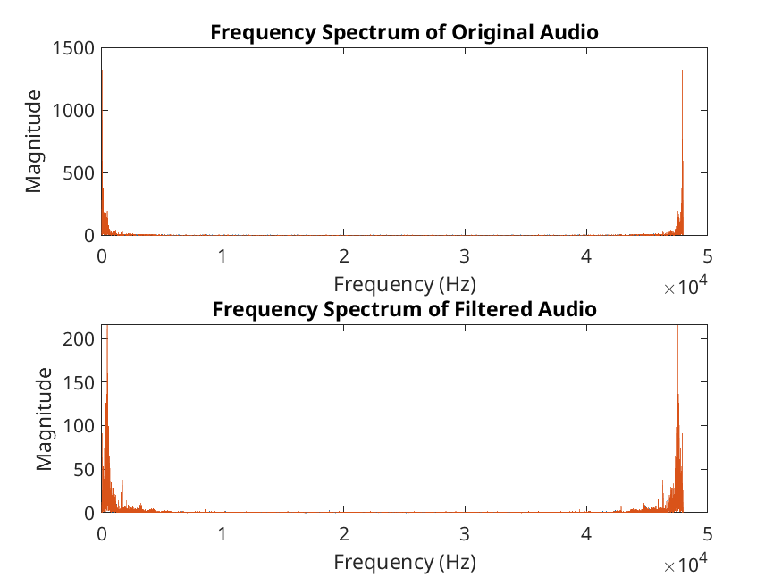
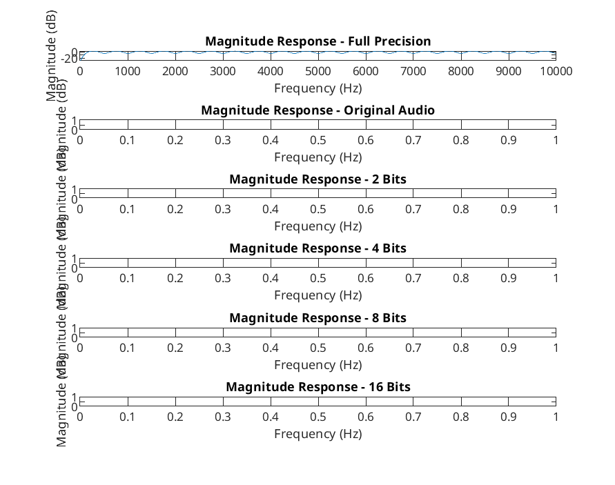

\clearpage


## Lab 3 - Part A: FIR Filter Design

### Lab / Problem Description
In this lab I was given an audio file that had a woman talking but in the background a constant tone. The objective was to remove this background tone. This was done by first identifying the frequency range that the tone was in and then designing an FIR filter to remove this tone. 

### Filter Designer Tool
The Filter Designer Tool inside matlab was used to create an FIR Filter to the following specifications:
* Stopband attenuation > 90dB
* Passband ripple < 0.02 dB
* Passband edge frequency 3.375 kHz
* Stopband edge frequency 5.625 kHz
* Sampling frequency 20 kHz
This filter was then exported and tested against the audio file. This filter was however designed to remove the low-mid range frequencies which was not where our constant tone was so it simply muffled the voice we wanted to keep. In order to design for the correct frequency range we needed to identify the frequency of the tone.

### Filter Design
To then design the filter that filters the correct frequencies out there were 3 main steps:

#### Identifying the Noise
The first step was to identify the frequency of the noise. This was done in two ways. THe first of which was to plot the frequency response of the audio file across all frequencies. From observing this plot we could see that the tone was around 200hz.\
The second way was to use the FFT function in matlab to find the frequency of the noise. This was done by taking the FFT of the audio file and then finding the frequency with the highest amplitude, this gave use the frequency of the tone which was then printed to terminal.

#### Designing the FIR Filter
After using the FIR filter designer tool in the previous step I decided to instead use the firpm function in matlab to design the filter after changing the specifications of the filter instead as this gave me the ability to iterate on the filter design much quicker. This also gave me the ability to take the identified tone frequency as a parameter in the calculation of the FIR filter specifications which would benefit code re-usability if ever repurposed. The final filter was a low pass filter and was designed with the following specifications:

```matlab
samplingFrequency = 20000;
passbandFrequency = 2 * identifiedNoiseFrequency;
stopbandFrequency = identifiedNoiseFrequency + ( identifiedNoiseFrequency / 3) ;
passbandRipple = 0.02;
stopbandAttenuation = 90;
```

The transition region for this filter with a noise frequency of 178 hz was approximately 120hz which was large enough to ensure that matlab would not have any issues and that the filter would work effectively. \
The FIR filter was designed using the firpm function which has a linear phase response. This means that the phase shift across frequencies is directly proportional to frequency, meaning that all frequencies within the passband have the same delay. This helps prevent phase distortion of the speech signal. \

When the filter was applied, the output audio file had the tone removed, and the voice was clear, as shown in the frequency response graphs for the pre- and post-filtered audio files:

When the code was run with this filter the output audio file had the tone removed and the voice was clear. This can be seen from the frequency response graph of the pre and post filtered audio files:\


#### Quantising the Filter
The final step was to quantise the filter coefficients to determine whether the output was under-quantised, correctly-quantised or over-quantised.
Quantisation is the process of mapping the filter coefficients to a limited set of values. The amount of bits determines the amount of values in the set. The filter coefficients are then rounded to the nearest value in the set.\
Over-quantisation is when the filter coefficients are have been quantised into too small a set space, in the case of this lab that was at 4 bits with even more pronounced effects at 2 bits. The result of an over-quantised filter is that the output audio file has not got the tone removed.\
Under-quantisation is when the filter coefficients have been quantised into too large a set space, the result of this is no different from the result of a correctly-quantised filter but there is an unnecessary increase in resource usage. In the case of this lab that was at 16 bits.\
Correct-quantisation is when the filter coefficients have been quantised into the smallest possible set space where the result of the filter still produces the desired results. This produces the correct result with the lowest possible resource usage. In the case of this lab that was at 8 bits.
The magnitude response for each of these quantisation levels was plotted and the results were as follows:



### Reflections
This lab taught me a great deal about FIR filters. I learned how to design them using the filter design tool in matlab and also through a scripts using the firpm function. I also learned about the effects of quantisation on the filter coefficients and how to determine the correct amount of bits to use. I learned how to identify a frequency in an audio file and design a filter to remove it. This lab was a great learning experience and I feel much more confident in my ability to design filters now.