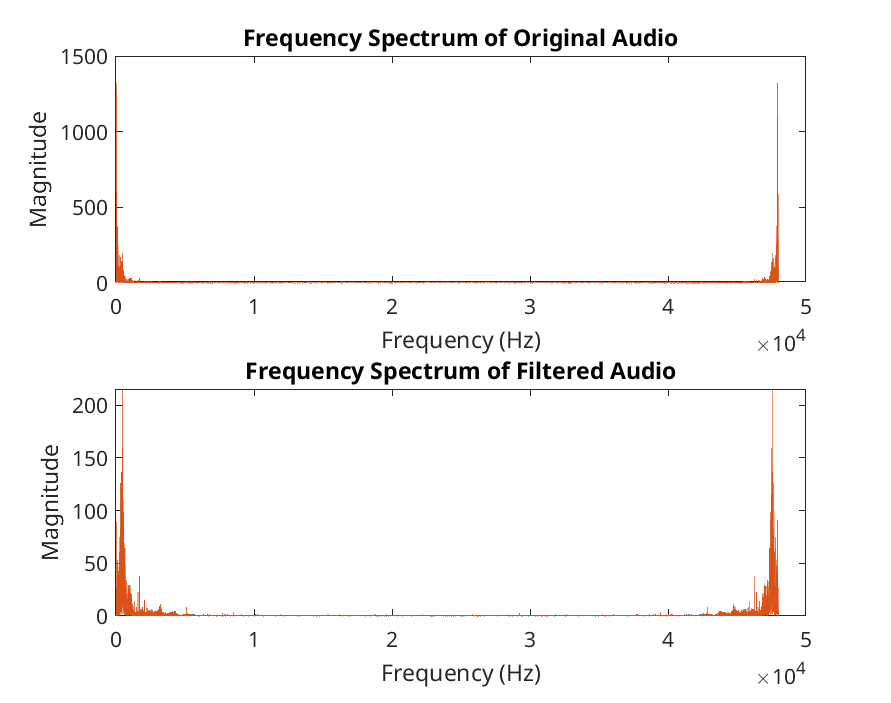

\clearpage


## Lab 3 - Part 2:  FIR Filter Hardware Implementation

### Lab / Problem Description

In this lab we are using the knowledge learned in the previous lab to create an FIR filter again for a different audio file. This time we are going to implement the filter on the FPGA and examine the output with graphs and listening to the audio. We are going to do the same as the previous lab where we will design the filter in matlab and export the coefficients to the FPGA. We will then compare the output of the filter on the FPGA to the output of the simulated filter. We will implement the filter by editing the FIR filter ip to achieve our designed functionality.

### Description of designed filter

#### Filter design process

The filter designed is a low pass filter designed to remove background noise from an audio file. The background noise sounds to be a fan. \
The filter specifications are as follows:\

- Sampling Frequency: 20,000 Hz
- Stopband Frequency: 94 Hz
- Passband Frequency: 120 Hz
- Passband Ripple: 0.02 dB
- Stopband Attenuation: 120 dB

These specifications do not entirely remove the background noise but they very significantly reduce it to the point where I can no longer hear it through my laptop speakers only through my headphones. Later when examining the graphs we will see the noise still present but significantly reduced.

#### Filter coefficients export

The creation of the filter was the same as the previous lab where the filter creation was scripted in matlab and the coefficients were exported to a file (In this case a .coe file). That was done with this line of code here:

```matlab
coewrite(fixedPointFilter, 10, '../outputs/filter_coefficients.coe');
```

### IP Descriptions

The provided scripts automatically generated a block diagram with all of the required IP. My tcl script then saved this diagram as a pdf then converted it to a png with this code here:

```tcl
write_bd_layout -format pdf -orientation landscape $working_dir/outputs/block_diagram.pdf -force
exec convert -density 300 $working_dir/outputs/block_diagram.pdf -rotate 90 $working_dir/outputs/block_diagram.png
```

The block diagram that was produced from this is shown below:/

\

The block diagram includes a dozen different IP blocks, their functions are as follows:\

* processing_system7_0: Is a process that acts as the main controller, managing data flow and interfacing with AXI interconnects and peripherals.
* axi_interconnect_0, axi_interconnect_1, axi_interconnect_2: Forwards data across IP blocks connecting ADC, DMA, and processing blocks.
* adc_if_0 (ADC Interface): Receives high-speed ADC data and prepares it for processing, receiving external ADCs and sending data to processing block.
* fifo_0 and fifo_1 (FIFO Buffers): Temporarily stores data to prevent timing issues.
* axi_dma_0 (DMA): Moves data between memory and IP blocks its transactions are managed by the processor
* fft_0 (FFT Processor): performs fast fourier transform on incoming data.
* axi_gpio_0, axi_gpio_1 (GPIO Controllers): basic i/o for external devices.
* axi_timer_0 (Timer): supplies clock signals
* fir_compiler_0 (FIR Filter): implements FIR filter with coefficients from the .coe file
* axi_uartlite_0 (UART): provides a serial interface with processor for jupyter control.
* axi_gpio_2 (Additional GPIO): additional i/o for external devices.
* xadc_wiz_0 (XADC): monitors temperature and voltage.\

The most important block for this lab is the FIR filter which we will make edits to in the next section.

#### FIR Filter edits

The FIR filter was edited to include the coefficients from the .coe file and also to make a number of other changes such as coefficient width, data width and quantization. The tcl command in the script to make this changes are as follows:

```tcl
start_gui
open_bd_design lab.srcs/sources_1/bd/base_filter/base_filter.bd

startgroup
set_property -dict [list \
    CONFIG.CoefficientSource {COE_File} \
    CONFIG.Coefficient_File {/home/patrick/Documents/IntegratedSystemsDesign/labs/lab3/outputs/filter_coefficients.coe} \
    CONFIG.Coefficient_Fractional_Bits {0} \
    CONFIG.Coefficient_Sets {1} \
    CONFIG.Coefficient_Sign {Signed} \
    CONFIG.Coefficient_Structure {Inferred} \
    CONFIG.Coefficient_Width {16} \
    CONFIG.Data_Width {32} \
    CONFIG.Output_Width {32} \
    CONFIG.Quantization {Integer_Coefficients} \
] [get_bd_cells fir_compiler_0]
endgroup

save_bd_design

stop_gui
```

This will open the block diagram which has to be done via the GUI then make the changes to the FIR filter, save the block diagram and closes the GUI again.

### Audio Graphs (Pre and Post Filter)

Graphs were generated automatically by the provided pynb scripts. The graphs show the audio against time for the original audio and the filtered audio for both the hardware and software filters. The graphs are shown below:

{width=50%}
{width=50%}
{width=50%}
{width=50%}
{width=50%}\

Each of the graphs look reasonably similar but we can see that there is a significant reduction in the noise of the filtered audio. We can see no difference between the hardware and software filter outputs. There appear to be almost if not completely identical.

### Hardware vs Software filter comparison

Although the output of the software and hardware filter is very similar the time it took them to perform the operation is significantly different. The hardware filter took only 0.058 seconds to process the audio while the software filter took 0.38 seconds. This is over a 5x speedup which although not too significant for such a small file could be very significant for larger files whether that be longer or higher quality audio files. The hardware filter is also massively more power-efficient than the software filter but this is a difficult metric to measure.\
The hardware filter would be much more useful in a live application where the audio is processed in real-time. The software filter for its simplicity and ease of use may be more useful for small-scale applications.

#### Results/Discussion

#### Reflections